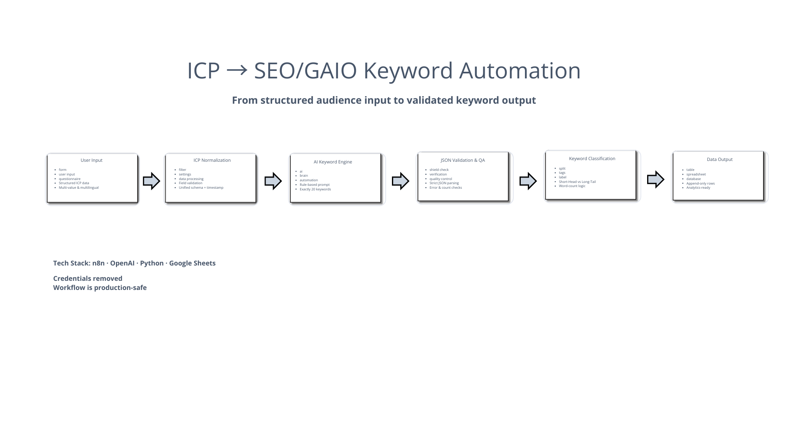

# n8n Workflow: ICP → SEO/GAIO Keywords → Google Sheets

Dieses Repository versioniert n8n-Workflows als JSON-Dateien.

---

## Workflow ArchiArchitektur

---

## Inhalt

- `n8n/workflows/` – exportierte n8n-Workflows (JSON)
- optional: `docs/` – zusätzliche Doku / Screenshots

## Workflow: ICP → SEO/GAIO Keywords → Google Sheets

### Zweck

- Nimmt ICP-Daten über ein Formular entgegen (Form Trigger).
- Generiert **exakt 20 SEO/GAIO Keywords** (Short-Head & Long-Tail) via OpenAI.
- Schreibt **pro Keyword eine Zeile** in Google Sheets.

### Eingabe (Formularfelder)

- `branche`
- `target_role`
- `age`
- `target_goal`
- `target_pain`
- `target_land`
- `language`

### Ausgabe (Google Sheets – pro Keyword eine Zeile)

- Zeitstempel
- Branche
- Zielgruppenrolle
- Alter
- Ziele der Zielgruppe
- Ängste der Zielgruppe
- Land/Region der Zielgruppe
- Sprache der Keywords
- Keyword (Gesamt)
- Short-Head (optional)
- Long-Tail (optional)

## Import in n8n

1. n8n öffnen
2. Workflows → **Import from File**
3. JSON aus `n8n/workflows/` auswählen
4. Credentials neu verbinden (OpenAI, Google Sheets)

## Wichtige Hinweise (Sicherheit)

- **Keine Secrets committen** (keine Tokens/Keys in Dateien).
- Credentials gehören in n8n: **Settings → Credentials**
- Für GitHub: Secrets in **Repo Settings → Secrets and variables**

## Empfohlene Repo-Konventionen

- Branches: `feature/...`, `fix/...`, `chore/...`
- Commits: `feat: ...`, `fix: ...`, `chore: ...`

## Lizenz

Dieses Projekt ist unter der MIT-Lizenz lizenziert. Weitere Informationen
findest du in der Datei [LICENSE](LICENSE).
